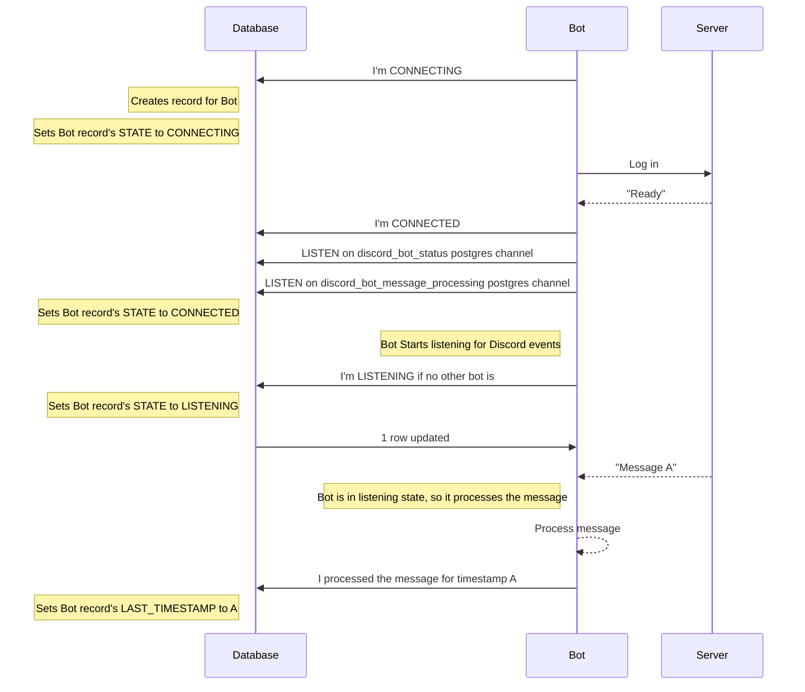
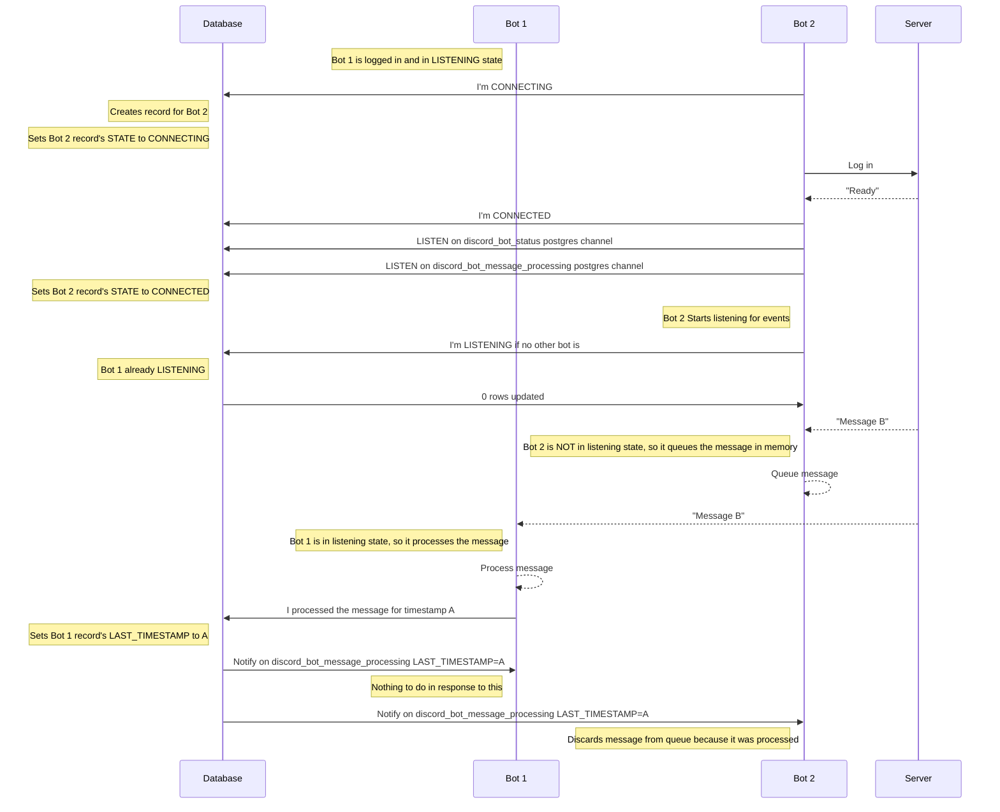
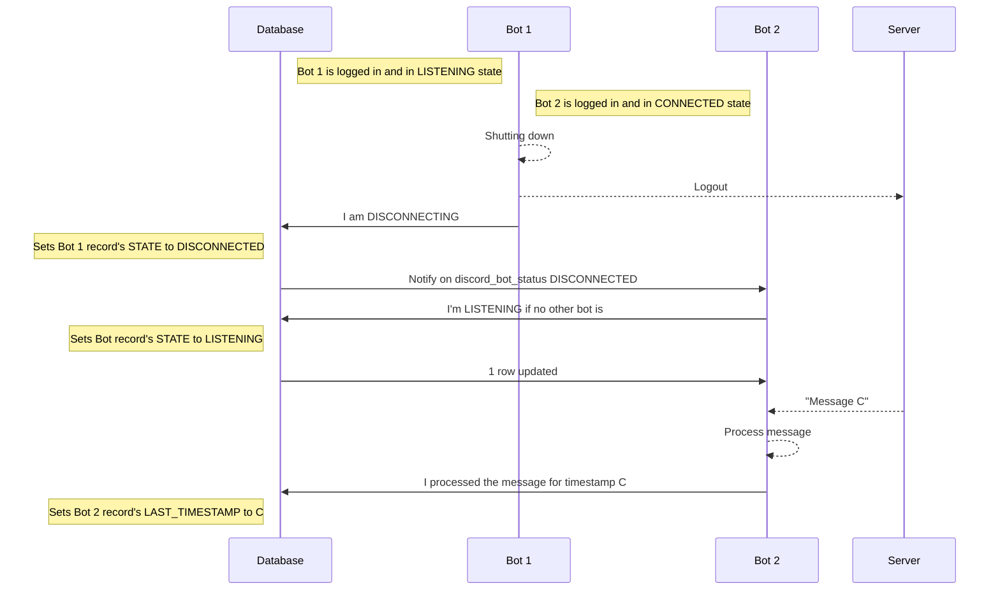

# Cardbot
## discord_bots table

| Name                   | Type      | Nullability |
|------------------------|-----------|-------------|
| bot_id                 | string    | NOT NULL    |
| bot_type               | string    | NOT NULL    |
| status                 | enum: CONNECTING,CONNECTED,LISTENING,DISCONNECTED,UNRESPONSIVE | NOT NULL |
| last_message_id        | string    | NULL        |

## Handling multiple bot instances

Single bot



Two bots



Two bots, Bot 1 shuts down normally, Bot 2 immediately takes over



Two bots, Bot 1 becomes unresponsive, Bot 2 takes over after 30 seconds


Message Processing Decision Tree

```mermaid
flowchart TD
    message[Message event] --> MessageType{Message Type?}
    MessageType -->

```