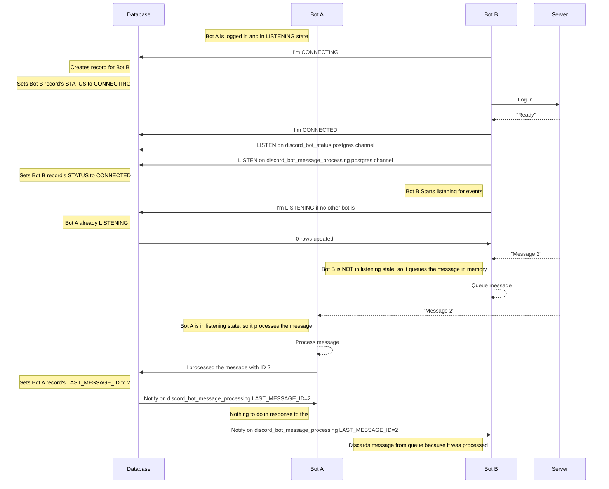
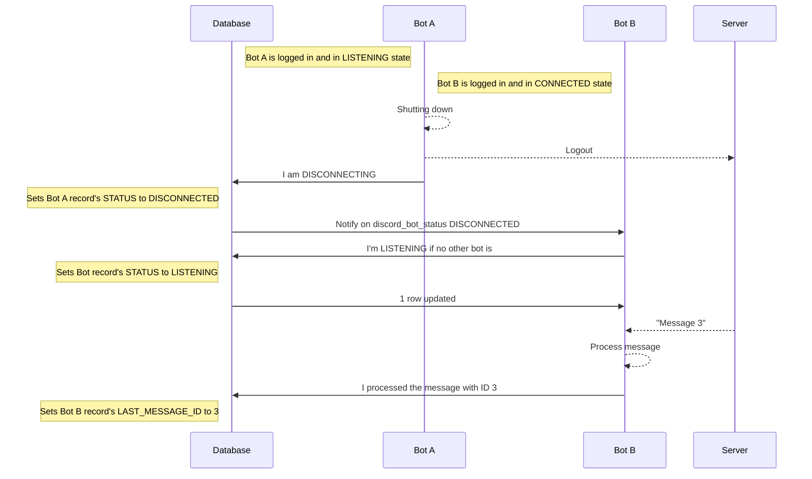
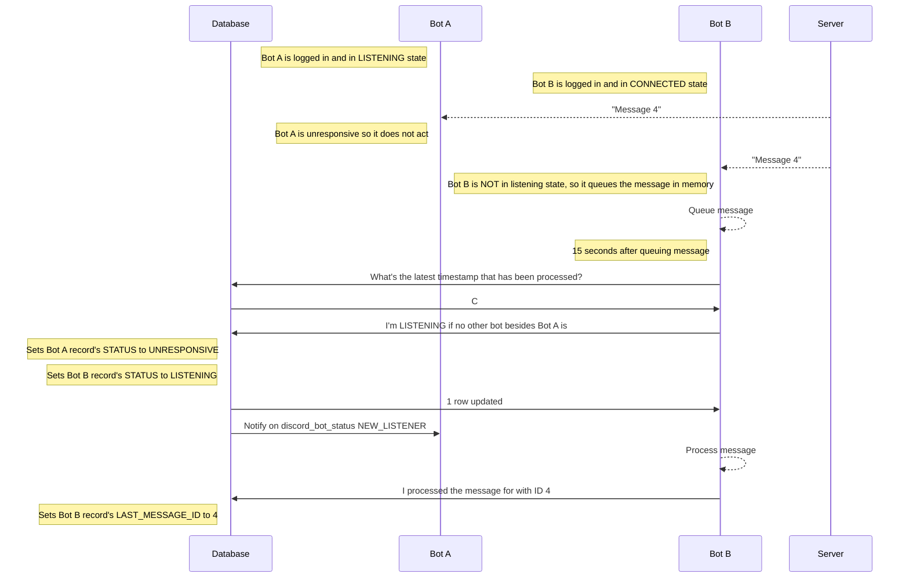

# Cardbot
## discord_bots table

| Name                   | Type      | Nullability |
|------------------------|-----------|-------------|
| bot_id                 | string    | NOT NULL    |
| bot_type               | string    | NOT NULL    |
| status                 | enum: CONNECTING,CONNECTED,LISTENING,DISCONNECTED,UNRESPONSIVE | NOT NULL |
| last_message_id        | string    | NULL        |

## Handling multiple bot instances

Single bot

Two bots

Two bots, Bot A shuts down normally, Bot B immediately takes over

Two bots, Bot A becomes unresponsive, Bot B takes over after 15 seconds

